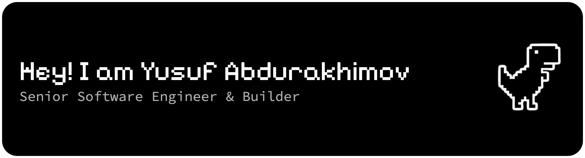

<!--  -->

<!-- profile banner -->
<h3 align="center">My current focus is on user behavior and persuasive technologies.</h3>

<p align="center">
  <a href="https://github.com/uwussimo">
    
  </a>
  
  
</p>

---

### about
- building software that **shapes behavior, not just interfaces**
- deeply interested in **persuasive systems, habit formation, and behavioral design**
- exploring how feedback loops, friction, and incentives influence long-term change
- designing tools meant to help people **break bad habits and achieve real goals**

### tech stack
```txt
frontend   → typescript, react, next.js
mobile     → react native, expo
backend    → node.js, apis
```
